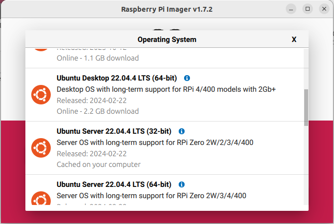
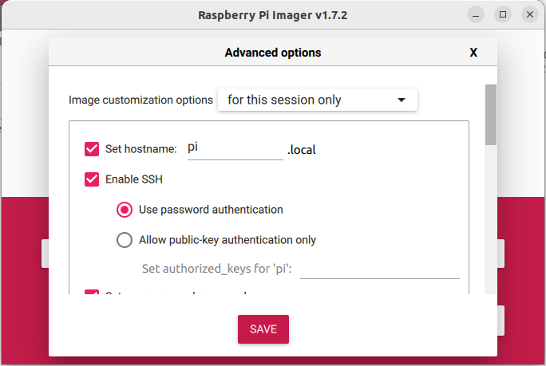
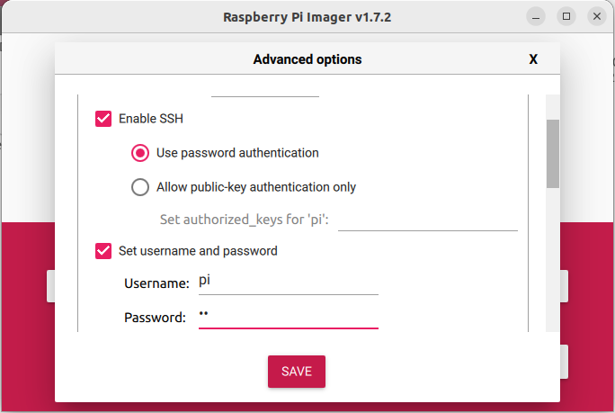
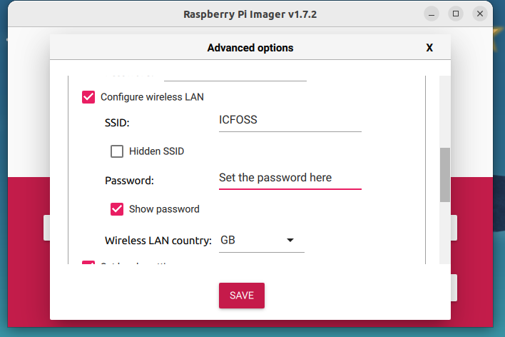

# Acoustic Rain Gauge Setup Guide

## Hardware Setup
- Use Raspberry Pi 4 as board 
- Insert SD Card
- Connect USB Microphone and LAN
- Connect Davis to GPIO pin number 13 and ground (optional)

## Software Setup
### 1. Install Ubuntu Server 22.04.4 LTS (64-bit) using **Raspberry Pi Imager** Software


### 2. Enable SSH Settings, give user credentials and WiFi credentials




### 3. Flash the operating system and boot the Raspberry Pi

### 4. Check IP is getting assigned in Ethernet and Wifi

```bash
ip -br a
```
Both Ethernet and Wifi should be UP and IP should be assigned

### 5. Update and upgrade OS

```bash
sudo apt update
sudo apt upgrade
sudo reboot
```

### 6. Clone project repository and setup environment

```bash
# clone repo
git clone https://github.com/cksajil/rainfall_monitor.git

# Set executable permission for setup.sh
chmod a+x rainfall_monitor/src/setup.sh

# run setup.sh
bash rainfall_monitor/src/setup.sh
```
* NOTE: There is an option for zerotier installation during initial setting up or you can do it manually by Following the instructions on [Zerotier for Raspberry Pi Tutorial](https://pimylifeup.com/raspberry-pi-zerotier/). Go to  [Zerotier](https://my.zerotier.com/) platform and login with the credentials shared via email/open project to monitor/connect to device IPs.

### 7. Check audio recording system

* Check in command line if microphone is detected
```bash
lsusb
```
This will list out all the USB devices connected to Raspberry Pi. To make sure that microphone is getting detected run the above command without connecting microphone and see the output. Repeat the same after connecting the microphone. Now the microphone or soundcard name should appear in the list as an additional entry.

* Check if $arecord$ command lists the input devices
```bash
arecord -l
```
* Reboot the Raspberry Pi
```bash
sudo reboot
```
* After rebooting check if $arecord$ command is working
```bash
# Records a 5 second test audio as wav file
arecord --duration=5 sample.wav

# Delete the test file
rm sample.wav
```
### 8. Enable I2C (for moisture sensor),UART (for battery monitoring) communication and Reboot
```bash
sudo raspi-config
# interfacing options >> I2C >> yes
# interfacing options >> serial port >> no >> yes
sudo reboot
```
### 9. Connect and Setup ADS1115 ADC Module and Grove moisture sensor to Raspberry Pi 4

#### Hardware mapping 

| ADC1115 | Physical Pin                 | Grove Sensor        |
|---------|------------------------------|---------------------|
| VDD     | 5V                           | VCC                 |
| GND     | GND                          | GND                 |
| SCL     | 5 (SCL.1)                    |                     |    
| SDA     | 3 (SDA.1)                    |                     |
| ADDR    | GND                          |                     |    
| A0      |                              | Grove Sensor output |

####  Check if I2C device is detected
```bash
i2cdetect -y 1
```
### 10. Connect and setup battery monitoring
#### Hardware mapping

* optocoupler connection diagram can be seen [here](https://github.com/cksajil/rainfall_monitor/blob/gitlab/docs/images/optocupler%20conectin.png)
* optocoupler pinout can be seen [here](https://github.com/cksajil/rainfall_monitor/blob/gitlab/docs/images/opto%20coupler.png)

| Pi physical Pin       | optocoupler | solar charge controlller |
|-----------------------|-------------|--------------------------|
|                       | 1           | TX (via 470ohm resistor) |
|                       | 2           | GND                      |
| 10 (GPIO 15-RX)       | 3           |                          |
| 39 (GND) via 470ohm R | 3           |                          |
| 1 (3.3v)              | 4           |                          |
   
### 11. Connect and Setup RFM95 Module to Raspberry Pi 4
#### Hardware mapping 

The complete WiringPi pin mapping can be seen [here](https://raw.githubusercontent.com/cksajil/rainfall_monitor/gitlab/src/lmic_rpi/raspberry_pi_wiring_gpio_pins.png) 
| WiringPi Pin | Function        | Physical Pin    |
|--------------|-----------------|-----------------|
| 0            | Reset           | 11              |
| 4            | DIO0            | 16              |
| 5            | DIO1            | 18              |
| 1            | DIO2 (Not used) | 12              |      
| 12           | MOSI            | 19              |
| 13           | MISO            | 21              |
| 14           | SCK             | 23              |
| 6            | SS              | 22              |     
| 25           | LORAWAN LED     | 37              |
| GND          | GND             | 39              |
| 3.3V         | +3.3V           | 1               |

### 12. Add influx-db yaml file (`influxdb_api.yaml`) or LoraWAN keys yaml file (`lorawan_keys.yaml`) to config folder
Download these from `API_Keys` folder in `SWSICFOSS`  Google Drive. 

### 13. Edit device details in config file
```bash
# open config.yaml
nano /home/pi/raingauge/src/config/config.yaml

# edit device name based on names in infulxdb or lora key files
eg: 
    device_name: rainpi_test
    device_name: rainpi_x

# edit device location
eg: 
    device_location: greenfield tvm 

# edit device field deployment status
eg:
    field_deployed: false
```
### 14. Setup the python script run automatically after booting 

you can do this in many ways
* Using bashrc
* Running the script as service
 
```bash
# Append Python script execution command to .bashrc file 
echo "python3 /home/pi/raingauge/src/daq_pi.py" >> ~/.bashrc

# Reboot the device
sudo reboot
```


